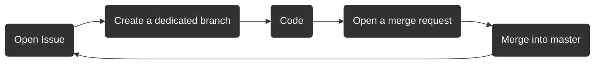

# Situation Frontend Canvas

A [React Flow](https://reactflow.dev)-based canvas for IT infrastructure visualization.

## Run locally

- `yarn install`
- `yarn dev`

The `/public` directory contains network JSON objects, these are loaded dynamically when the app starts.

## Building for production

- `yarn install`
- `yarn build`
- the static website is now available in the `/dist` folder.

## Embedding

Because of the React Flow dependency, the canvas is implemented in React. However, it is easy to embed the application in other frameworks using the [custom element wrapper included in the project](src/situation-canvas.tsx).

Using the wrapper script, setting up a canvas even on a static HTML page is just a few lines of code:

```html
<situation-canvas />

<script>
  document.querySelector("situation-canvas").canvasData = []; // Insert backend data here
</script>
```

> Note: to be mindful of performance, the custom element only takes HTML properties and renders once at the time that property is provided.

### Embedding in a vanilla javascript application

In the [index.html](index.html) file, simply comment the `src/main.tsx` script import and uncomment the `src/main-vanilla.ts` one. This implmenetation shows how developers can render the canvas on a regular HTML page with no frameworks.

### Embedding in a Vue.js application

Embedding into a Vue.js application is very similar to vanilla javascript:

```vue
<script>
export default {
  data() {
    return {
      canvasData: [], // Insert backend data here
    };
  },
};
</script>

<template>
  <!-- use the .prop modifier to make sure data is passed as a property -->
  <situation-canvas :canvasData.prop="canvasData" />
</template>
```

## Speaking with the backend

The repo embeds an auto-generated ts client (located at `src/client`) to ease the interaction with the backend. Below is an short example to fetch some data (obviously the API is richer).

```ts
import {DataApi, Configuration, Node, ExportApi, ReactFlow} from '../client';

const config = new Configuration({
    basePath: '<BACKEND-URL>', // http://127.0.0.1:8000
    headers: {'Content-Type': 'application/json'},
    apiKey: 'Api-Key <YOUR-API-KEY>', // Api-Key ErdxWd9w.H40z0d5YgSVoVroqcf0sF0ZK6BQlwevc
});

const dataAPI = new DataApi(config);
const exportAPI = new ExportApi(config);

dataAPI
    .dataNodeList()
    .then((response: Node[]) => {
        console.log(response);
    })
    .catch((reason: any) => {
        console.log(reason);
    });

exportAPI
    .exportReactFlowRetrieve()
    .then((response: ReactFlow) => {
        console.log(response);
    })
    .catch((reason: any) => {
        console.log(reason);
    });
```


## Developers

Here is the basic workflow for development:



### Open issue

Everyone can open an issue.

- Go to the Gitlab UI: `Issues (left panel) -> List -> New Issue (top right)`.
- Provide a simple but meaningful title (like _add a killer feature_, or _fix this problem_).
- Give a description of what you have in mind. Fill the description with as many elements as possible like the way to solve the issue, the links that may be interesting, the integration within the project, what is expected in the end etc.
- Provide **relevant labels**, or create them if they do not exist (be general, like "API", "security", "UI" etc.)
- You can assign yourself if you want

### Create a dedicated branch

Please use only your terminal (i.e. not the Gitlab UI).

Ensure that you start from the `main` branch

```shell
git checkout main
```

Create a new branch. The name of the branch must follow the following
format: `<issue-id>-<title-of-the-issue-in-lowercase-with-dash>`. Example:

```shell
git checkout -b 4-add-a-killer-feature
```

### Code

Ok, here you do your best. But you should follow some basic rules:

- track only the relevant files (avoid GBytes files, or PDF, binaries...). You should use a `.gitignore` file for this purpose.
- make small commits with a nice meaningful message (yes, this the hardest point)
- push also regularly (to the dedicated branch!)

Example:

```shell
git add this_new_component.tsx
git commit -m "new component that works very well"
git push origin 4-add-a-killer-feature
```

If you want to add all the tracked files (all the files you may have added with `git add`) to
the next commit you can use the shortcut `git add -u`.

If you want to remove a file from the tracking (:warning: the file will also be removed for the file system):

```shell
git rm this_old_component.tsx
git commit -m "remove this old component"
```

You can keep the file locally with the `--cached` option: `git rm --cached this_old_component.tsx`.

### Open a merge request (MR)

When you push from your terminal, `git` may show you a link to create a merge request, just follow this link.
You can also create this MR from the Gitlab UI with `Merge requests (left panel) -> New merge request`;
You should select your dedicated branch as the source branch and `main` as the target branch.

When the MR is open, you can still push code to the branch.
This is useful during the review to fix possible errors before the merge.
When a MR is open, some CI jobs are also likely to be triggered at every push
to ensure some aspect of the projects: quality, effective features, packaging etc.

### Merge

When the code in the dedicated branch is ready to be merged, you merely have to trigger the
step in the Gitlab UI. You should also remove the branch and you can possibly squash the commits
(flat all the commits to a single one) if the MR is not "too big".
